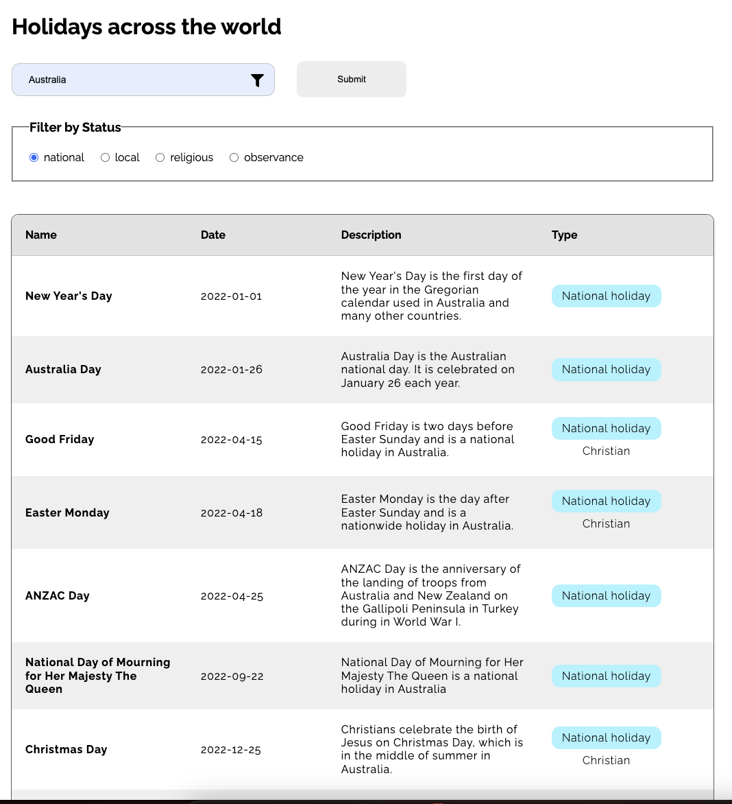

This is a practical project in order to improve my skills using the latest technology.




## Table of contents

- [Table of contents](#table-of-contents)
- [Getting Started](#getting-started)
- [Tech I used](#tech-i-used)
- [API](#api)
- [Challenge](#challenge)
- [Learn More](#learn-more)
- [Deploy on Vercel](#deploy-on-vercel)

## Getting Started

Firstly, install node_modules dependencies

```bash
pnpm install
```

And then, run the development server:

```bash
pnpm dev
```

Open [http://localhost:3000](http://localhost:3000) with your browser to see the result.

## Tech I used

- React
- Next.js 13
- CSS3 Module
- React Query
- Test Library()

## API

Worldwide Holidays and Observances RESTful API

- [Calendarific API](https://calendarific.com/api-documentation)
- [API Documentation](https://calendarific.com/api-documentation)

## Challenge

Some of challenges, I am facing and trying to overcome:

- Show autocomplete while searching
- Add pagination if there are more than 20 holidays.
- The table only shows “Name” and “Date”, and has “Collapso rows” with the type and description. for responsive design
- Implement a dropdown menu
- An “API key” input saved on localStorage
- Use react-query with Next SSR

## Learn More

To learn more from this project, take a look at the following resources:

- [Border Property](https://stackoverflow.com/questions/628301/the-border-radius-property-and-border-collapsecollapse-dont-mix-how-can-i-use) - To resolve border issue
- [React Query Course](https://www.youtube.com/watch?v=NQULKpW6hK4) - data-fetching library with fetching, caching, synchronising, and updating the server state in my react application

## Deploy on Vercel

You can see my project on Vercel [Demo Link](https://world-holidays.vercel.app)
